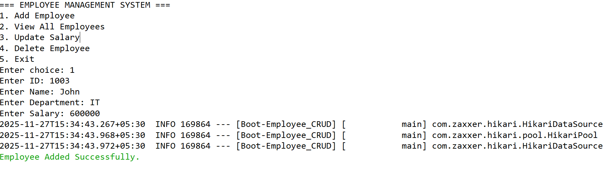
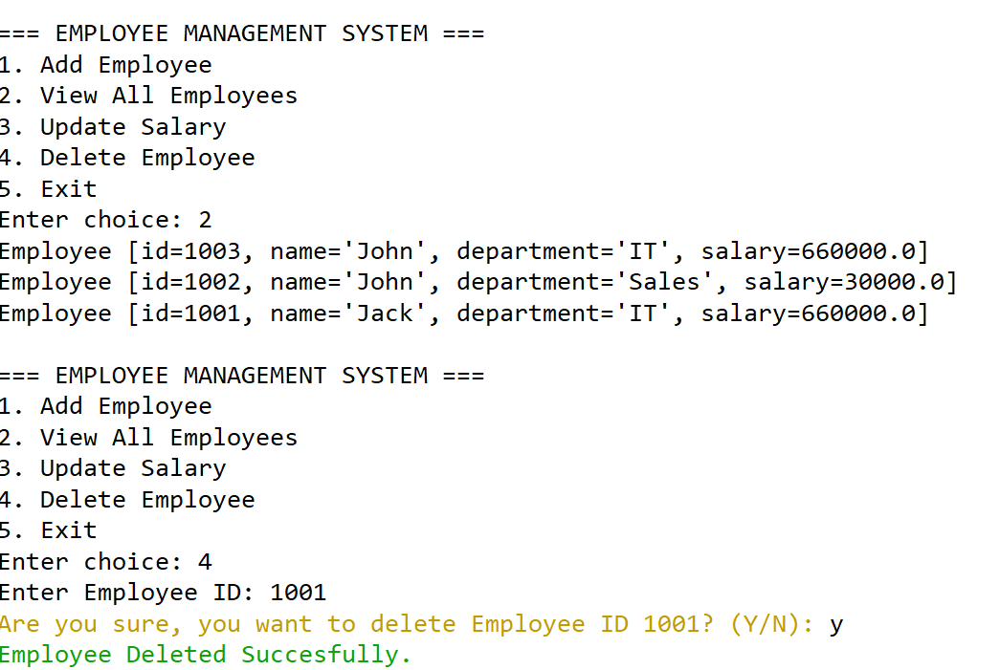
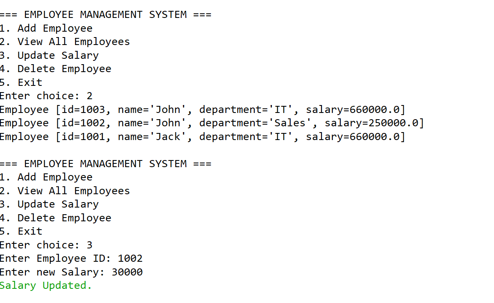

# Employee Management System (Spring Boot + Oracle)

## Description
This is a console-based Employee Management System built using Spring Boot, Plain JDBC (DataSource), and Oracle 21c.  
It allows you to:
- Add Employees
- View All Employees
- Update Employee Salary
- Delete Employees

---

## Features
- Spring Boot 4.0.0
- Oracle JDBC (ojdbc11)
- Plain JDBC DataSource
- Console-based UI with input validation
- Confirmation before deletion

---

## Folder Structure

Boot-Employee_CRUD/

├── src/

│ ├── main/

│ │ ├── java/com/cs/

│ │ │ ├── BootEmployeeCrudApplication.java

│ │ │ ├── controller/

│ │ │ │ └── EmployeeController.java

│ │ │ ├── dao/

│ │ │ │ └── EmployeeDAO.java

│ │ │ └── service/

│ │ │ └── EmployeeService.java

│ │ └── resources/

│ │ └── application.properties

├── pom.xml

└── README.md

---

## Prerequisites
- Java 21
- Maven 3.x
- Oracle Database 21c
- Oracle JDBC Driver (ojdbc11)
- Spring Boot 4.0.0

  ---

## Sample Output

### Adding Employee

### Deleting Employees

### Updating Salary

